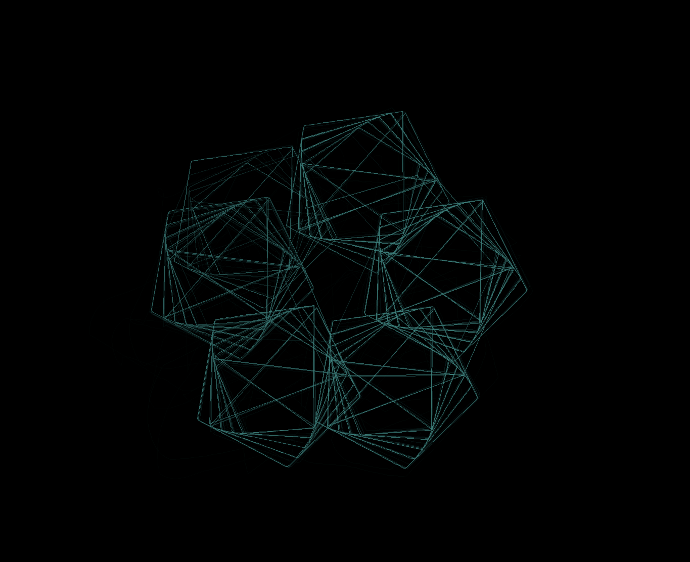

# softscope

> 오실로스코프의 동작을 모방한 2D 서라운드 오디오 비주얼라이저 


* [visuallized audio from](https://www.youtube.com/watch?v=jQjJZbgMw7E)

오디오를 시각화 하는 형식중엔, X 축을 시간으로 두고, Y 축을 값으로 두어 
시간에 따른 파형 변화를 시각화 하는 경우가 많습니다.
하지만 이 시각화는 조금 독특합니다.

시각화 영역에 시간축이 없습니다. 입력 오디오는 무조건 스테레오며,
왼쪽 샘플 값을 X, 오른쪽 샘플 값을 Y, 또는 그 반대로 둡니다.
시간에 따라 2차원 상에서 해당 X, Y 좌표는 변하며, 이 변하는 
X, Y 좌표의 흔적을 그리면 나오는것이 바로 위 사진입니다.

이는 오실로스코프라 불리우는 전자 장비가 신호를 시각화 하는 방식중 하나이기도 합니다.
이 프로젝트는 저런 오실로스코프의 시각화를
소프트웨어로 가장 근접하게 구현하는것을 목표로 합니다

# installation

```shell
python3 -m pip install git+https://github.com/ityeri/softscope.git
```

# run

오디오 파일 시각화:
```shell
python3 -m softscope.file_scope audio_file.mp4
```

실시간 마이크 입력 시각화:
```shell
python3 -m softscope.mic_scope
```

-d 옵션으로 녹음 장치의 번호를 명시할수 있습니다.
```
python3 -m softscope.mic_scope -d 2
```

사용 가능한 녹음 장치 목록은 아래 명령어로 확인할수 있습니다
```shell
python3 -m softscope.check
```

**TODO** 일부 linux 환경에선 `mic_scope` 나 `softscope.check` 가 동작하지 않습니다
